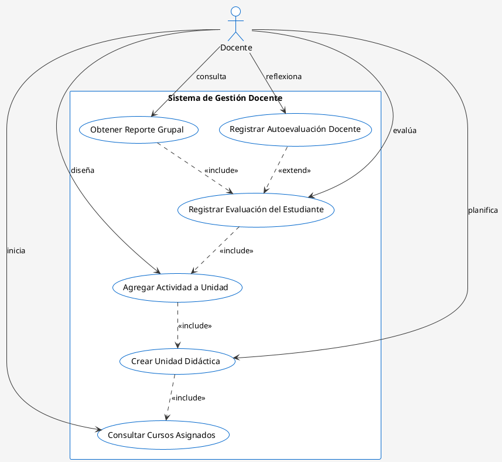

# Diagrama de Casos de Uso — Módulo Docente

## Descripción General

Este diagrama UML de Casos de Uso representa las funcionalidades del módulo **Docente** en la plataforma Semilleros UTN. Muestra los actores principales, casos de uso, y sus relaciones con conexiones etiquetadas.

---

## Estructura del Diagrama

### **Actores**
- **Docente**: Usuario autenticado que accede al sistema para crear contenido educativo, evaluar estudiantes y registrar el progreso académico

### **Sistema**
- **Sistema de Gestión Docente** (rectángulo contenedor)

### **Casos de Uso Principales**
1. **Consultar Cursos Asignados**
2. **Crear Unidad Didáctica**
3. **Agregar Actividad a Unidad**
4. **Registrar Evaluación del Estudiante**
5. **Obtener Reporte Grupal**
6. **Registrar Autoevaluación Docente**

### **Relaciones**
- **Asociación directa**: El actor accede directamente al caso de uso
- **<<Include>>**: Caso de uso que incluye (depende de) otro caso de uso
- **<<Extend>>**: Caso de uso que extiende la funcionalidad de otro

---

## Código PlantUML (Para Generar la Imagen)

Copia el siguiente código en [PlantUML Online](https://www.plantuml.com/plantuml/uml/) o en tu herramienta IA:



---

## Elementos del Diagrama Detallados

### **1. Actor: Docente**
```
Representación:
    ⭕
    |
Significado: Usuario docente que interactúa con el sistema para gestionar 
el proceso educativo y evaluación de estudiantes
```

### **2. Casos de Uso (Óvalos)**

| Caso de Uso | Descripción | Trigger | RF |
|---|---|---|---|
| **Consultar Cursos Asignados** | Visualiza la lista de cursos/aulas asignadas al docente | Docente inicia sesión | - |
| **Crear Unidad Didáctica** | Registra la planificación dinámica (ámbito, objetivos, destrezas) | Docente inicia planificación | RF-D01 |
| **Agregar Actividad a Unidad** | Inserta una actividad con sus criterios y descriptores en la unidad | Docente diseña actividades | RF-D02 |
| **Registrar Evaluación del Estudiante** | Inserta un nuevo elemento en el historial de evaluación del estudiante | Docente evalúa actividades | RF-D03 |
| **Obtener Reporte Grupal** | Retorna conteo consolidado de alumnos por nivel (Iniciado/En Proceso/Logrado) | Docente necesita análisis grupal | RF-D05 |
| **Registrar Autoevaluación Docente** | Guarda el formulario reflexivo del maestro de forma privada | Docente reflexiona sobre su labor | RF-D07 |

### **3. Relaciones (Conexiones)**

#### **Asociación Directa** (línea continua)
```
Docente ───[inicia]──→ Consultar Cursos Asignados
```
- **Tipo**: Asociación simple
- **Significado**: El actor puede ejecutar directamente el caso de uso
- **Ejemplos**: Todas las asociaciones directas con el actor

#### **Relación <<Include>>** (línea punteada)
```
Crear Unidad Didáctica ···[<<include>>]···→ Consultar Cursos Asignados
```
- **Significado**: Para crear una unidad, SIEMPRE debe consultar primero sus cursos
- **Obligatorio**: Sí, es parte del flujo

```
Agregar Actividad a Unidad ···[<<include>>]···→ Crear Unidad Didáctica
```
- **Significado**: Para agregar actividades, SIEMPRE debe tener una unidad creada
- **Obligatorio**: Sí

```
Registrar Evaluación del Estudiante ···[<<include>>]···→ Agregar Actividad a Unidad
```
- **Significado**: Para evaluar, SIEMPRE debe haber una actividad disponible
- **Obligatorio**: Sí

```
Obtener Reporte Grupal ···[<<include>>]···→ Registrar Evaluación del Estudiante
```
- **Significado**: El reporte se genera a partir de evaluaciones registradas
- **Obligatorio**: Sí

#### **Relación <<Extend>>** (línea punteada)
```
Registrar Autoevaluación Docente ···[<<extend>>]···→ Registrar Evaluación del Estudiante
```
- **Significado**: El docente EXTIENDE su evaluación con autorreflexión personal
- **Obligatorio**: No, es opcional

---

## Flujo de Casos de Uso Principales

### **Flujo 1: Planificación y Diseño de Contenido**
```
1. Docente inicia sesión
2. Consulta "Cursos Asignados"
3. Selecciona un curso
4. Crea "Unidad Didáctica" (especifica ámbito, objetivos, destrezas)
   → Incluye obligatoriamente los cursos previos
5. Agrega "Actividad a Unidad" (diseña criterios de evaluación)
   → Incluye obligatoriamente crear unidad
6. Resultado: Contenido educativo estructurado y listo para estudiantes
```

### **Flujo 2: Evaluación Integral**
```
1. Docente inicia sesión
2. Accede a "Registrar Evaluación del Estudiante"
   → Incluye automáticamente: cursos → unidades → actividades
3. Evalúa estudiantes según criterios y descriptores
4. Opcionalmente: Registra su "Autoevaluación Docente"
   → Extiende el proceso de evaluación con reflexión personal
5. Consulta "Reporte Grupal"
   → Visualiza consolidado de estudiantes por nivel
6. Resultado: Evaluación completa con análisis grupal e introspección docente
```

### **Flujo 3: Análisis y Toma de Decisiones**
```
1. Docente registra evaluaciones
2. Obtiene "Reporte Grupal" para un grupo/actividad
3. Analiza patrones de aprendizaje
4. Ajusta estrategias pedagógicas si es necesario
5. Actualiza actividades o crea nuevas unidades basado en resultados
```

---

## Precondiciones y Postcondiciones

### **Precondiciones Generales**
- El docente debe estar autenticado con rol "rol-doc"
- Debe tener al menos un curso asignado
- Las unidades deben estar creadas antes de agregar actividades
- Las actividades deben estar disponibles para registrar evaluaciones
- Los estudiantes deben estar inscritos en el curso

### **Postcondiciones Generales**
- Se registran todos los cambios en la BD con timestamps
- Se mantiene el historial de evaluaciones (RNF-06: No sobreescribir versiones anteriores)
- Se generan notificaciones para padres (si aplica)
- Se actualiza la caché del servidor
- Se registra auditoría de cambios en logs

---

## Instrucciones para Generar la Imagen con IA

### **Opción 1: ChatGPT o Claude**
```
Prompt sugerido:

"Genera un diagrama UML de casos de uso en formato imagen basándote en 
la siguiente especificación PlantUML:

[Copia el código PlantUML de arriba aquí]

Requisitos:
- El actor (Docente) debe estar a la izquierda
- El rectángulo del sistema 'Sistema de Gestión Docente' debe estar a la derecha
- Los 6 casos de uso dentro del rectángulo como óvalos azules
- Líneas continuas para asociaciones normales (desde Docente a cada caso de uso)
- Líneas punteadas para <<include>> y <<extend>> (entre casos de uso)
- Etiquetas claras: 'inicia', 'planifica', 'diseña', 'evalúa', 'consulta', 'reflexiona'
- Colores: Actor en círculo azul, casos de uso en óvalos azul claro
- Estructura jerárquica de arriba a abajo: Consultar → Crear → Agregar → Registrar → Reporte/Autoevaluación
- Estilo profesional, similar a diagrama UML estándar"
```

### **Opción 2: PlantUML Online**
1. Ve a https://www.plantuml.com/plantuml/uml/
2. Copia el código de la sección "Código PlantUML"
3. Pégalo en el editor
4. Haz clic en "Save as PNG" o "Export"

### **Opción 3: Lucidchart o Draw.io**
```
Elementos a recrear manualmente:

1. Actor (círculo con palote)
   - Etiqueta: "Docente"
   - Posición: Izquierda

2. Rectángulo del sistema
   - Etiqueta: "Sistema de Gestión Docente"
   - Posición: Centro-derecha

3. Óvalos (casos de uso) - Jerarquía de arriba a abajo:
   Nivel 1:
   - Consultar Cursos Asignados
   
   Nivel 2:
   - Crear Unidad Didáctica
   
   Nivel 3:
   - Agregar Actividad a Unidad
   
   Nivel 4:
   - Registrar Evaluación del Estudiante
   
   Nivel 5:
   - Obtener Reporte Grupal
   - Registrar Autoevaluación Docente (al lado)

4. Líneas desde Docente (continuas):
   - Docente --[inicia]--> Consultar Cursos Asignados
   - Docente --[planifica]--> Crear Unidad Didáctica
   - Docente --[diseña]--> Agregar Actividad a Unidad
   - Docente --[evalúa]--> Registrar Evaluación del Estudiante
   - Docente --[consulta]--> Obtener Reporte Grupal
   - Docente --[reflexiona]--> Registrar Autoevaluación Docente

5. Líneas entre casos de uso (punteadas):
   - Crear Unidad Didáctica ·····[<<include>>]····> Consultar Cursos Asignados
   - Agregar Actividad a Unidad ·····[<<include>>]····> Crear Unidad Didáctica
   - Registrar Evaluación del Estudiante ·····[<<include>>]····> Agregar Actividad a Unidad
   - Obtener Reporte Grupal ·····[<<include>>]····> Registrar Evaluación del Estudiante
   - Registrar Autoevaluación Docente ·····[<<extend>>]····> Registrar Evaluación del Estudiante
```

---

## Especificaciones Técnicas para la Imagen

### **Dimensiones recomendadas**
- Ancho: 1000-1200 px (más ancho que Padres de Familia debido a más casos de uso)
- Alto: 800-900 px
- Resolución: 300 DPI (para impresión)

### **Colores sugeridos**
- Actor: Azul (#0066CC)
- Casos de uso: Azul claro (#CCE5FF)
- Sistema (rectángulo): Azul muy claro (#F0F5FF)
- Líneas continuas: Gris oscuro (#333333)
- Líneas punteadas: Gris (#666666)
- Texto: Negro (#000000)

### **Fuentes**
- Fuente principal: Arial o Helvetica
- Tamaño: 11-12pt para etiquetas de casos de uso
- Tamaño: 10pt para etiquetas de relaciones
- Peso: Negrilla para actor y sistema

---

## Mapeo a Operaciones GraphQL

Este diagrama se mapea directamente a las siguientes operaciones del Backend:

### **Queries**
```graphql
# Caso de Uso: Consultar Cursos Asignados
query {
  cursosPorDocente(docenteId: ID!)
}

# Caso de Uso: Obtener Reporte Grupal
query {
  obtenerReporteGrupal(cursoId: ID!, actividadId: ID!)
}

# Caso de Uso: Registrar Evaluación (data retrieval)
query {
  obtenerEstudiante(estudianteId: ID!)
  obtenerActividad(actividadId: ID!)
}
```

### **Mutations**
```graphql
# Caso de Uso: Crear Unidad Didáctica
mutation {
  crearUnidadDidactica(input: {
    cursoId: ID!
    ambito: String!
    objetivos: [String!]!
    destrezas: [String!]!
  })
}

# Caso de Uso: Agregar Actividad a Unidad
mutation {
  agregarActividadAUnidad(
    unidadId: ID!
    input: {
      titulo: String!
      criterios: [CriterioInput!]!
      descriptores: [DescriptorInput!]!
    }
  )
}

# Caso de Uso: Registrar Evaluación del Estudiante
mutation {
  registrarEvaluacion(
    estudianteId: ID!
    actividadId: ID!
    criteriosInput: [EvaluacionCriterioInput!]!
    fichaInput: FichaObservacionInput!
  )
}

# Caso de Uso: Registrar Autoevaluación Docente
mutation {
  registrarAutoevaluacionDocente(
    actividadId: ID!
    respuestasInput: [RespuestaAutoevaluacionInput!]!
  )
}
```

---

## Relación con Otros Módulos

```
┌──────────────────────────────────────────────────────────────┐
│                  SISTEMA SEMILLEROS UTN                      │
├──────────────────────────────────────────────────────────────┤
│                                                               │
│  ┌──────────────────────┐    ┌──────────────────────────┐   │
│  │  MÓDULO DOCENTE ◄────┼─── │  MÓDULO PADRES           │   │
│  │  (Este diagrama)      │    │                          │   │
│  └────────┬─────────────┘    └──────┬───────────────────┘   │
│           │                         │                       │
│      [Crea]                    [Consulta]                   │
│      Unidades/Actividades      Evaluaciones                │
│      [Registra]                [Marcaactividades]           │
│      Evaluaciones                                           │
│           │                         │                       │
│           └────────────┬────────────┘                       │
│                        ▼                                    │
│                [BASE DE DATOS]                              │
│          (MongoDB con Transacciones)                        │
│                                                               │
│  Flujo de Información:                                       │
│  1. Docente crea contenido → BD                             │
│  2. BD sincroniza → Frontend Docente                        │
│  3. BD sincroniza → Frontend Padre                          │
│  4. Padre consulta evaluaciones de hijo                     │
│                                                               │
└──────────────────────────────────────────────────────────────┘
```

---

## Notas y Observaciones

1. **Casos de Uso Futuros** que podrían agregarse:
   - Crear cuestionarios de autoevaluación
   - Enviar retroalimentación a estudiantes
   - Generar reportes exportables (PDF)
   - Configurar rúbricas de evaluación
   - Crear grupos de trabajo colaborativo
   - Gestionar entregas de tareas
   - Visualizar estadísticas por trimestre

2. **Restricciones de Acceso**:
   - El docente solo puede ver/evaluar estudiantes de sus cursos
   - Las evaluaciones son privadas hasta que el padre las consulte
   - Las autoevaluaciones solo son visibles para el propio docente
   - No puede editar unidades/actividades que ya tienen evaluaciones registradas

3. **Consideraciones de Diseño**:
   - El historial de evaluaciones NUNCA se sobrescribe (Requisito No-Funcional RNF-06)
   - Las mutaciones son transaccionales (MongoDB transactions)
   - Se aplica caché al servidor después de cada cambio
   - Se auditan todos los cambios para cumplimiento normativo

4. **Integraciones**:
   - Sincroniza con el módulo de Padres
   - Se conecta a BD centralizada
   - Genera notificaciones en tiempo real
   - Integra con sistema de roles (rol-doc)

---

## Comparativa: Docente vs. Padres de Familia

| Aspecto | Docente | Padres |
|---|---|---|
| **Actores** | 1 (Docente) | 1 (Padre) |
| **Casos de Uso** | 6 | 4 |
| **Complejidad** | Alta (CRUD + reportes) | Media (Lectura + confirmación) |
| **Relaciones Include** | 4 | 1 |
| **Relaciones Extend** | 1 | 1 |
| **Flujo Principal** | Crear → Evaluar → Reportar | Consultar → Monitorear |
| **Bidireccionalidad** | Envía datos | Recibe datos |

---

## Archivo Generado
- **Nombre**: `Diagrama_Casos_Uso_Docente.md`
- **Ubicación**: `PdfInfo/`
- **Fecha**: 2026-06-01
- **Versión**: 1.0
- **Relación con**: `Diagrama_Casos_Uso_Padres_de_Familia.md`
