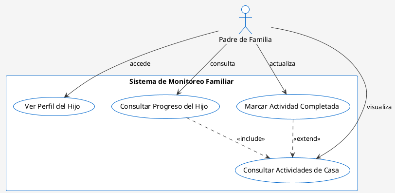

# Diagrama de Casos de Uso — Módulo Padres de Familia

## Descripción General

Este diagrama UML de Casos de Uso representa las funcionalidades del módulo **Padres de Familia** en la plataforma Semilleros UTN. Muestra los actores principales, casos de uso, y sus relaciones con conexiones etiquetadas.

---

## Estructura del Diagrama

### **Actores**
- **Padre de Familia**: Usuario autenticado que accede al sistema para monitorear el progreso de su(s) hijo(s)

### **Sistema**
- **Sistema de Monitoreo Familiar** (rectángulo contenedor)

### **Casos de Uso Principales**
1. **Ver Perfil del Hijo**
2. **Consultar Progreso del Hijo**
3. **Consultar Actividades de Casa**
4. **Marcar Actividad Completada**

### **Relaciones**
- **Asociación directa**: El actor accede directamente al caso de uso
- **<<Include>>**: Caso de uso que incluye (depende de) otro caso de uso
- **<<Extend>>**: Caso de uso que extiende la funcionalidad de otro

---

## Código PlantUML (Para Generar la Imagen)

Copia el siguiente código en [PlantUML Online](https://www.plantuml.com/plantuml/uml/) o en tu herramienta IA:



---

## Elementos del Diagrama Detallados

### **1. Actor: Padre de Familia**
```
Representación:
    ⭕
    |
Significado: Usuario padre que interactúa con el sistema
```

### **2. Casos de Uso (Óvalos)**

| Caso de Uso | Descripción | Trigger |
|---|---|---|
| **Ver Perfil del Hijo** | Visualiza información del perfil del hijo (nombre, edad, sección, etc.) | Padre accede al menú de perfil |
| **Consultar Progreso del Hijo** | Revisa el progreso académico y evaluaciones del hijo | Padre selecciona "Ver Progreso" |
| **Consultar Actividades de Casa** | Lista las actividades/tareas asignadas para realizar en el hogar | Padre accede a "Actividades" |
| **Marcar Actividad Completada** | Registra que completó una actividad con su hijo | Padre confirma finalización |

### **3. Relaciones (Conexiones)**

#### **Asociación Directa** (línea continua)
```
Padre de Familia ───[accede]──→ Ver Perfil del Hijo
```
- **Tipo**: Asociación simple
- **Significado**: El actor puede ejecutar directamente el caso de uso

#### **Relación <<Include>>** (línea punteada)
```
Consultar Progreso del Hijo ···[<<include>>]···→ Consultar Actividades de Casa
```
- **Significado**: Para consultar el progreso, SIEMPRE se incluye la visualización de actividades
- **Obligatorio**: Sí, es parte del flujo

#### **Relación <<Extend>>** (línea punteada)
```
Marcar Actividad Completada ···[<<extend>>]···→ Consultar Actividades de Casa
```
- **Significado**: Marcar como completada EXTIENDE la funcionalidad de consultar actividades
- **Obligatorio**: No, es opcional dentro del flujo

---

## Flujo de Casos de Uso

### **Flujo 1: Monitoreo del Hijo**
```
1. Padre de Familia inicia sesión
2. Accede a "Ver Perfil del Hijo"
3. Consulta el "Progreso del Hijo" 
   → Incluye automáticamente "Consultar Actividades de Casa"
4. Opcionalmente: "Marcar Actividad Completada"
   → Extiende "Consultar Actividades"
```

### **Precondiciones**
- El padre debe estar autenticado
- Debe tener al menos un hijo registrado en el sistema
- Las actividades deben estar disponibles en la base de datos

### **Postcondiciones**
- Se registra el acceso del padre en los logs
- Si marca actividad completada, se actualiza el estado en la BDD
- Se notifica al docente del progreso (si aplica)

---

## Instrucciones para Generar la Imagen con IA

### **Opción 1: ChatGPT o Claude**
```
Prompt sugerido:

"Genera un diagrama UML de casos de uso en formato imagen basándote en 
la siguiente especificación PlantUML:

[Copia el código PlantUML de arriba aquí]

Requisitos:
- El actor (Padre de Familia) debe estar a la izquierda
- El rectángulo del sistema 'Sistema de Monitoreo Familiar' debe estar a la derecha
- Los 4 casos de uso dentro del rectángulo como óvalos azules
- Líneas continuas para asociaciones normales
- Líneas punteadas para <<include>> y <<extend>>
- Etiquetas claras en todas las conexiones
- Colores: Actores en círculos azules, casos de uso en óvalos azul claro
- Estilo profesional, similar a diagrama UML estándar"
```

### **Opción 2: PlantUML Online**
1. Ve a https://www.plantuml.com/plantuml/uml/
2. Copia el código de la sección "Código PlantUML"
3. Pégalo en el editor
4. Haz clic en "Save as PNG" o "Export"

### **Opción 3: Lucidchart o Draw.io**
```
Elementos a recrear manualmente:

1. Actor (círculo con palote)
   - Etiqueta: "Padre de Familia"
   - Posición: Izquierda

2. Rectángulo del sistema
   - Etiqueta: "Sistema de Monitoreo Familiar"
   - Posición: Centro-derecha

3. Óvalos (casos de uso)
   - Ver Perfil del Hijo
   - Consultar Progreso del Hijo
   - Consultar Actividades de Casa
   - Marcar Actividad Completada

4. Líneas:
   - Continuas (asociaciones)
   - Punteadas (include/extend)
   - Con etiquetas en los extremos
```

---

## Especificaciones Técnicas para la Imagen

### **Dimensiones recomendadas**
- Ancho: 800-1000 px
- Alto: 600-800 px
- Resolución: 300 DPI (para impresión)

### **Colores sugeridos**
- Actor: Azul (#0066CC)
- Casos de uso: Azul claro (#CCE5FF)
- Sistema (rectángulo): Azul muy claro (#F0F5FF)
- Líneas: Gris oscuro (#333333)
- Texto: Negro (#000000)

### **Fuentes**
- Fuente principal: Arial o Helvetica
- Tamaño: 11-12pt para etiquetas
- Peso: Negrilla para actores y sistema

---

## Relación con Otros Módulos

```
┌──────────────────────────────────────────────────┐
│          SISTEMA SEMILLEROS UTN                  │
├──────────────────────────────────────────────────┤
│                                                   │
│  ┌─────────────────┐    ┌──────────────────┐    │
│  │  MÓDULO DOCENTE │    │ MÓDULO PADRES ◄──┼─── │
│  │                 │    │ (Este diagrama)  │    │
│  └────────┬────────┘    └──────┬───────────┘    │
│           │                    │                │
│      [Registra]          [Consulta]            │
│      Evaluaciones     Progreso del hijo       │
│           │                    │                │
│           └────────┬───────────┘                │
│                    ▼                            │
│            [BASE DE DATOS]                      │
│                                                  │
└──────────────────────────────────────────────────┘
```

---

## Notas y Observaciones

1. **Casos de Uso Futuros** que podrían agregarse:
   - Enviar comentarios al docente
   - Recibir notificaciones de evaluaciones
   - Descargar reportes PDF
   - Ver histórico de progreso

2. **Restricciones de Acceso**:
   - El padre solo puede ver a su(s) hijo(s)
   - No puede acceder a información de otros alumnos
   - Las actividades marcadas como completadas requieren validación

3. **Integraciones**:
   - Sincroniza con el módulo de docentes
   - Se conecta a la BD centralizada
   - Genera notificaciones en tiempo real

---

## Archivo Generado
- **Nombre**: `Diagrama_Casos_Uso_Padres_de_Familia.md`
- **Ubicación**: `PdfInfo/`
- **Fecha**: 2026-06-01
- **Versión**: 1.0

