# Diagrama de Proceso — Docente

## Descripción General

Este diagrama de proceso muestra el flujo de actividades y decisiones que realiza un **Docente** al utilizar el módulo de gestión educativa en la plataforma Semilleros UTN. Incluye planificación de contenido, evaluación de estudiantes, generación de reportes y reflexión pedagógica.

---

## Estructura del Proceso

### **Entrada**
- Docente con credenciales de acceso
- Cursos asignados en el sistema
- Conexión a internet/dispositivo

### **Proceso Principal**
- Autenticación
- Selección de curso
- Planificación: Crear unidades didácticas
- Diseño: Agregar actividades con criterios
- Evaluación: Registrar evaluaciones de estudiantes
- Análisis: Consultar reportes grupales
- Reflexión: Registrar autoevaluación

### **Salida**
- Contenido educativo estructurado
- Evaluaciones documentadas
- Reportes de progreso grupal
- Reflexión docente registrada

---

## Código PlantUML — Diagrama de Actividades (Para Generar Imagen)

Copia el siguiente código en [PlantUML Online](https://www.plantuml.com/plantuml/uml/) o en tu herramienta IA:

```plantuml
@startuml Proceso_Docente
!theme plain
skinparam backgroundColor #F5F5F5
skinparam activityBorderColor #0066CC
skinparam activityBackgroundColor #CCE5FF
skinparam noteBackgroundColor #FFF9E6

start
:Docente accede a la aplicación;
:Ingresa credenciales (usuario/contraseña);

if (¿Credenciales válidas y es Docente?) then (Sí)
    :Inicia sesión;
    :Visualiza lista de cursos asignados;
else (No)
    :Muestra error de autenticación;
    :Rechaza acceso;
    stop
endif

:Selecciona un curso;
note right
  Información del curso:
  • Grado/Sección
  • Cantidad de estudiantes
  • Unidades didácticas existentes
end note

:Consulta unidades didácticas del curso;

if (¿Hay unidades existentes?) then (Sí)
    :Visualiza lista de unidades;
else (No)
    :Muestra "No hay unidades. ¿Crear nueva?";
endif

partition "BLOQUE 1: PLANIFICACIÓN Y DISEÑO" {
    if (¿Crear nueva unidad didáctica?) then (Sí)
        :Ingresa datos de unidad:
          - Ámbito
          - Objetivos
          - Destrezas a desarrollar;
        note right
          Planificación dinámica según
          Currículo Nacional Base (CNB)
        end note
        
        :Sistema valida datos;
        :Registra unidad en BD;
        :Muestra confirmación;
    else (No)
        :Trabaja con unidad existente;
    endif
    
    :Selecciona una unidad didáctica;
    :Visualiza actividades de la unidad;
    
    if (¿Agregar nueva actividad?) then (Sí)
        :Ingresa datos de actividad:
          - Título
          - Descripción
          - Duración estimada
          - Criterios de evaluación;
        note right
          Diseño de rubros de evaluación
          basado en descriptores
        end note
        
        :Define descriptores para cada criterio;
        :Sistema valida y registra;
        :Muestra confirmación;
    else (No)
        :Continúa con evaluación;
    endif
}

partition "BLOQUE 2: EVALUACIÓN" {
    :Accede a sección de evaluación;
    :Visualiza lista de estudiantes del curso;
    note right
      Total de estudiantes
      y su estatus de evaluación
    end note
    
    :Selecciona estudiante;
    :Selecciona actividad a evaluar;
    
    if (¿Evaluar este estudiante?) then (Sí)
        :Ingresa evaluación:
          - Nivel alcanzado por criterio
          - Observaciones
          - Recomendaciones;
        note right
          Niveles: Logrado, En Proceso, Iniciado
          Historial: NO se sobrescribe (RNF-06)
        end note
        
        :Sistema registra evaluación;
        :Se crea entrada en historial_versiones;
        :Muestra confirmación;
        :Notifica a Padre (si aplica);
    else (No)
        :Salta al siguiente estudiante;
    endif
    
    if (¿Más estudiantes para evaluar?) then (Sí)
        :Regresa a seleccionar estudiante;
    else (No)
        :Finaliza ciclo de evaluación;
    endif
}

partition "BLOQUE 3: ANÁLISIS Y REPORTES" {
    :Accede a reportes grupales;
    
    :Selecciona:
      - Actividad
      - Período;
    
    :Sistema genera reporte consolidado;
    note right
      Query: obtenerReporteGrupal()
      Agregaciones de MongoDB
      Conteo por nivel: Iniciado/En Proceso/Logrado
    end note
    
    :Visualiza reporte con:
      - Gráficos de distribución
      - Estadísticas por criterio
      - Estudiantes por nivel
      - Tendencias de aprendizaje;
    
    if (¿Analizar necesidades pedagógicas?) then (Sí)
        :Identifica:
          - Criterios problemáticos
          - Estudiantes en riesgo
          - Fortalezas del grupo;
        
        :Documenta hallazgos;
    else (No)
        :Continúa a autoevaluación;
    endif
}

partition "BLOQUE 4: REFLEXIÓN DOCENTE" {
    if (¿Registrar autoevaluación?) then (Sí)
        :Accede a formulario de autoevaluación;
        note right
          Privado: Solo visible para el docente
          Reflexión sobre la labor pedagógica (RNF-07)
        end note
        
        :Responde cuestionario reflexivo:
          - ¿Alcancé los objetivos?
          - ¿Qué funcionó bien?
          - ¿Qué puedo mejorar?
          - ¿Estrategias para próxima clase?;
        
        :Ingresa observaciones personales;
        :Sistema registra autoevaluación;
        :Muestra confirmación;
    else (No)
        :Salta autoevaluación;
    endif
}

partition "BLOQUE 5: AJUSTES Y CICLO" {
    if (¿Ajustar estrategias?) then (Sí)
        :Analiza reporte grupal;
        :Decide:
          - Reforzar criterios débiles
          - Cambiar metodología
          - Crear actividades adicionales;
        
        :Regresa a agregar nuevas actividades;
    else (No)
        :Ciclo de evaluación completo;
    endif
}

:Consulta próximas tareas pendientes;
:Cierra sesión;
:Sesión finalizada;
stop

@enduml
```



---

## Flujo Detallado del Proceso

### **FASE 1: ACCESO Y AUTENTICACIÓN**

**Paso 1.1 — Validación de Credenciales**
```
Entrada:    Docente abre aplicación
Acción:     Ingresa usuario y contraseña
Validación: 
  1. Verifica existencia en BD
  2. Valida contraseña
  3. Verifica rol = "rol-doc"
Resultado:  
  ✓ Éxito → Inicia sesión
  ✗ Fallo → Muestra error, máx. 3 reintentos
```

**Paso 1.2 — Carga del Dashboard**
```
Sistema recupera:
  • Cursos asignados
  • Cantidad total de estudiantes
  • Unidades didácticas creadas
  • Evaluaciones pendientes
  • Reportes recientes
Tiempo:     2-3 segundos (con caché)
Resultado:  Se muestra panel principal del docente
```

---

### **BLOQUE 1: PLANIFICACIÓN Y DISEÑO DE CONTENIDO**

**Paso 2.1 — Seleccionar Curso**
```
Pantalla:   Lista de cursos con:
            - Grado/Sección
            - Cantidad de estudiantes
            - Progreso general
            
Acción:     Docente selecciona curso
Resultado:  Se cargan datos del curso
```

**Paso 2.2 — Consultar Unidades Existentes**
```
Query:      SELECT * FROM UnidadDidactica 
            WHERE cursoId = ?
            
Información mostrada:
  • Nombre de unidad
  • Ámbito de aprendizaje
  • Cantidad de actividades
  • Fecha de creación
  • Estado (activa/inactiva)
```

**Paso 2.3 — Crear Nueva Unidad Didáctica**
```
Decisión:   ¿Crear nueva unidad didáctica?

SI (Camino A):
  Input requerido:
    - Ámbito de aprendizaje (ej: "Lenguaje")
    - Objetivos de la unidad (ej: "Desarrollar comprensión lectora")
    - Destrezas (ej: "Identifica idea principal")
    - Duración estimada
    - Recursos necesarios
    
  Validation:
    • Todos los campos obligatorios
    • Ámbito debe existir en catálogo
    • Destrezas debe coincidir con CNB
    
  Mutation:   crearUnidadDidactica(input)
  
  Resultado:
    ✓ Unidad registrada en BD
    ✓ Se genera ID único
    ✓ Muestra confirmación

NO (Camino B):
  • Trabaja con unidad existente
  • Continúa a agregar actividades
```

**Paso 2.4 — Agregar Actividad a Unidad**
```
Decisión:   ¿Agregar nueva actividad?

SI (Camino A):
  Input requerido:
    - Título de actividad
    - Descripción clara
    - Fecha de inicio
    - Fecha límite
    - Criterios de evaluación (array)
    - Descriptores por criterio
    - Duración estimada
    
  Validación:
    • Fecha límite > fecha inicio
    • Criterios válidos en catálogo
    • Descriptores asociados existen
    
  Mutation:   agregarActividadAUnidad(unidadId, input)
  
  Resultado:
    ✓ Actividad registrada
    ✓ Se vincula a unidad
    ✓ Disponible para estudiantes

NO (Camino B):
  • Continúa a fase de evaluación
```

---

### **BLOQUE 2: EVALUACIÓN DE ESTUDIANTES**

**Paso 3.1 — Acceder a Sección de Evaluación**
```
Acción:     Docente toca "Evaluar Estudiantes"
Sistema:    Carga lista de todos los estudiantes del curso
Información mostrada:
  • Nombre y ID del estudiante
  • Número de evaluaciones registradas
  • Última fecha de evaluación
  • Estado: Evaluado/Pendiente
```

**Paso 3.2 — Seleccionar Estudiante y Actividad**
```
Paso A:     Selecciona estudiante
Paso B:     Selecciona actividad a evaluar
Sistema:    Carga:
            - Criterios de evaluación
            - Descriptores de cada criterio
            - Observaciones previas (si existen)
```

**Paso 3.3 — Registrar Evaluación**
```
Decisión:   ¿Evaluar este estudiante?

SI:
  Input:
    - Por cada criterio:
      • Nivel alcanzado (Logrado/En Proceso/Iniciado)
      • Comentario específico
      
    - Observaciones generales (opcional)
    - Recomendaciones para mejorar
    
  IMPORTANTE (RNF-06):
    ✓ Historial NO se sobrescribe
    ✓ Se crea nueva entrada en historial_versiones
    ✓ Se preserva versión anterior
    ✓ Se registra timestamp de cambio
    
  Mutation:   registrarEvaluacion(
              estudianteId,
              actividadId,
              criteriosInput,
              fichaInput
            )
  
  Resultado:
    ✓ Evaluación registrada en BD
    ✓ Se agrega a historial (nueva versión)
    ✓ Notifica a padre del hijo
    ✓ Muestra confirmación

NO:
  • Salta al siguiente estudiante
```

**Paso 3.4 — Ciclo de Evaluación**
```
Pregunta:   ¿Más estudiantes para evaluar?

SI:         Regresa a Paso 3.1 (seleccionar estudiante)
NO:         Finaliza ciclo de evaluación
            Continúa a reportes
```

---

### **BLOQUE 3: ANÁLISIS Y REPORTES GRUPALES**

**Paso 4.1 — Acceder a Reportes**
```
Acción:     Docente toca "Ver Reportes"
Opciones disponibles:
  • Por actividad
  • Por período (Semanal/Mensual/Trimestral)
  • Por criterio específico
```

**Paso 4.2 — Generar Reporte Consolidado**
```
Selecciona:
  1. Actividad
  2. Período
  3. (Opcional) Criterio específico

Query:      obtenerReporteGrupal(cursoId, actividadId)

Backend:
  - Agregación MongoDB
  - Conteo de estudiantes por nivel
  - Cálculo de porcentajes
  - Estadísticas por criterio

Resultado:
  {
    total_estudiantes: 25,
    distribucion: {
      logrado: 15,        (60%)
      en_proceso: 8,      (32%)
      iniciado: 2         (8%)
    },
    por_criterio: [
      {
        criterio: "Comprensión Lectora",
        logrado: 18,
        en_proceso: 5,
        iniciado: 2
      },
      ...
    ]
  }
```

**Paso 4.3 — Visualizar Reporte**
```
Pantalla muestra:
  ✓ Gráficos de distribución (pastel, barras)
  ✓ Tabla de estadísticas por criterio
  ✓ Estudiantes listados por nivel
  ✓ Tendencias de aprendizaje
  ✓ Áreas de fortaleza
  ✓ Áreas de mejora
```

**Paso 4.4 — Análisis Pedagógico**
```
Decisión:   ¿Analizar necesidades pedagógicas?

SI:
  Docente identifica:
    • Criterios con bajo desempeño
    • Estudiantes en riesgo (Iniciado/En Proceso)
    • Fortalezas del grupo (Logrado ≥ 60%)
    • Patrones de aprendizaje
    
  Documenta hallazgos en notas privadas

NO:
  • Continúa a autoevaluación
```

---

### **BLOQUE 4: REFLEXIÓN DOCENTE (AUTOEVALUACIÓN)**

**Paso 5.1 — Acceder a Autoevaluación**
```
Acción:     Docente toca "Registrar Autoevaluación"
Nota:       Privada - Solo visible para el docente (RNF-07)

Decisión:   ¿Registrar autoevaluación?
```

**Paso 5.2 — Completar Cuestionario Reflexivo**
```
SI:
  Preguntas reflexivas:
    1. ¿Alcancé los objetivos de la unidad?
       Escala: Totalmente / Parcialmente / No alcancé
       
    2. ¿Qué estrategias funcionaron bien?
       Campo: Texto abierto (máx. 500 caracteres)
       
    3. ¿Qué desafíos encontré?
       Campo: Texto abierto
       
    4. ¿Qué puedo mejorar para próximas evaluaciones?
       Campo: Texto abierto
       
    5. Observaciones adicionales:
       Campo: Texto abierto (opcional)
  
  Mutation:   registrarAutoevaluacionDocente(
              actividadId,
              respuestasInput
            )
  
  Resultado:
    ✓ Autoevaluación registrada en BD
    ✓ Privada (solo acceso docente)
    ✓ Incluye timestamp
    ✓ Se vincula a actividad

NO:
  • Salta autoevaluación
  • Continúa a ajustes
```

---

### **BLOQUE 5: AJUSTES Y CICLO CONTINUO**

**Paso 6.1 — Decidir Ajustes Pedagógicos**
```
Decisión:   ¿Ajustar estrategias basado en reportes?

SI:
  Docente analiza reporte y decide:
    A) Reforzar criterios débiles
       → Crea actividades adicionales de apoyo
       → Diseña estrategias diferenciadas
       
    B) Cambiar metodología
       → Modifica enfoque de enseñanza
       → Crea nuevas unidades si es necesario
       
    C) Crear actividades remediales
       → Para estudiantes en Iniciado
       → Basadas en descriptores no alcanzados
  
  Acción:    Regresa a Bloque 1 (crear nuevas actividades)

NO:
  • Ciclo de evaluación completado
  • Continúa a próximo período
```

---

### **FASE 7: CIERRE DE SESIÓN**

**Paso 7.1 — Finalización**
```
Acción:     Docente consulta próximas tareas
Sistema:    Muestra:
            - Evaluaciones por registrar
            - Unidades en progreso
            - Notificaciones de padres

Paso 7.2 — Logout
Acción:     Toca "Cerrar Sesión"
Sistema:
  ✓ Guarda progreso automático
  ✓ Limpia localStorage
  ✓ Cierra conexión
  ✓ Redirige a login

Resultado:  Sesión finalizada, datos protegidos
```

---

## Decisiones Clave en el Proceso

### **Decisión 1: ¿Credenciales Válidas y es Docente?**
```
Camino A (Sí):   Continúa al dashboard
Camino B (No):   Rechaza acceso, máx. 3 reintentos
```

### **Decisión 2: ¿Crear Nueva Unidad Didáctica?**
```
Camino A (Sí):   Ingresa datos → Valida → Registra
Camino B (No):   Trabaja con unidad existente
```

### **Decisión 3: ¿Agregar Nueva Actividad?**
```
Camino A (Sí):   Ingresa criterios y descriptores → Registra
Camino B (No):   Continúa a evaluación
```

### **Decisión 4: ¿Evaluar Este Estudiante?**
```
Camino A (Sí):   Ingresa nivel, criterios, observaciones
                 → Valida → Registra en historial
                 → Notifica a padre
                 
Camino B (No):   Salta al siguiente estudiante
```

### **Decisión 5: ¿Más Estudiantes para Evaluar?**
```
Camino A (Sí):   Regresa a seleccionar estudiante
Camino B (No):   Finaliza ciclo
```

### **Decisión 6: ¿Analizar Necesidades Pedagógicas?**
```
Camino A (Sí):   Identifica fortalezas y áreas de mejora
                 Documenta hallazgos
                 
Camino B (No):   Continúa a autoevaluación
```

### **Decisión 7: ¿Registrar Autoevaluación?**
```
Camino A (Sí):   Completa cuestionario reflexivo
                 Registra en BD (privado)
                 
Camino B (No):   Salta autoevaluación
```

### **Decisión 8: ¿Ajustar Estrategias?**
```
Camino A (Sí):   Crea nuevas actividades o unidades
                 Diseña estrategias remediales
                 Regresa a Bloque 1
                 
Camino B (No):   Ciclo completo, próximo período
```

---

## Tiempo Estimado de Cada Fase

| Fase | Duración | Notas |
|---|---|---|
| Autenticación | 2-3 seg | Validación de credenciales |
| Seleccionar curso | 1-2 seg | Carga lista de cursos |
| Crear unidad | 3-5 min | Planificación pedagógica |
| Agregar actividades | 10-15 min | Por actividad |
| Evaluación/estudiante | 5-10 min | Según cantidad de criterios |
| Ciclo evaluación (grupo) | 30-60 min | Para 25 estudiantes |
| Generar reportes | 2-3 seg | Agregación MongoDB |
| Analizar reportes | 5-10 min | Toma de decisiones |
| Autoevaluación | 5-10 min | Reflexión del docente |
| **Total por ciclo** | **1-2 horas** | Depende de grupo |

---

## Validaciones del Proceso

| Validación | Punto de Control | Acción si Falla |
|---|---|---|
| Rol de usuario | Autenticación | Rechaza acceso |
| Curso asignado | Seleccionar curso | Muestra lista vacía |
| Datos de unidad | Crear unidad | Requiere campos obligatorios |
| Criterios válidos | Agregar actividad | Valida contra catálogo |
| Nivel de evaluación | Registrar evaluación | Rechaza si es nulo |
| Historial completo | Registrar evaluación | Preserva versiones previas |
| Comentario obligatorio | Autoevaluación | Requiere mínimo 10 caracteres |

---

## Flujos Alternativos / Excepciones

### **Excepción 1: Estudiante Sin Actividades**
```
Trigger:    Docente selecciona estudiante pero no hay actividades
Acción:     Sistema muestra "No hay actividades para esta evaluación"
Opción:     Crear nueva actividad primero
```

### **Excepción 2: Actualizar Evaluación Existente**
```
Trigger:    Docente evalúa mismo estudiante en misma actividad
Acción:     Sistema NO sobrescribe (RNF-06)
Resultado:  Se crea NUEVA entrada en historial_versiones
            Las versiones previas se preservan con timestamps
Acceso:     Docente puede visualizar histórico de evaluaciones
```

### **Excepción 3: Reporte Sin Datos**
```
Trigger:    Docente solicita reporte pero aún no hay evaluaciones
Acción:     Sistema muestra gráfico vacío con mensaje
            "No hay evaluaciones registradas para este período"
Opción:     Crear evaluaciones primero
```

### **Excepción 4: Conexión Interrumpida**
```
Trigger:    Pérdida de conexión durante evaluación
Acción:     Sistema intenta guardar automáticamente cada 30 seg
            Si falla, muestra alerta al docente
Opción:     Reintentar o guardar borradores en localStorage
```

### **Excepción 5: Múltiples Cursos**
```
Escenario:  Docente tiene varios cursos asignados
Pantalla:   Selector de curso inicial
Cambio:     Puede cambiar de curso sin cerrar sesión
Datos:      Se aislan por curso para seguridad
```

---

## Especificaciones Técnicas para la Imagen

### **Dimensiones recomendadas**
- Ancho: 1000-1200 px
- Alto: 1800-2000 px (proceso muy largo, requiere altura extra)
- Resolución: 300 DPI (para impresión)

### **Colores sugeridos**
- Inicio/Fin: Azul (#0066CC)
- Actividades: Azul claro (#CCE5FF)
- Decisiones: Amarillo (#FFE680)
- Particiones/Bloques: Bordes azules punteados
- Flechas Sí: Verde (#00AA00)
- Flechas No: Rojo (#CC0000)
- Notas: Amarillo pálido (#FFF9E6)
- Líneas: Gris oscuro (#333333)

### **Fuentes**
- Fuente principal: Arial o Helvetica
- Tamaño: 10-11pt para actividades
- Tamaño: 9pt para etiquetas
- Tamaño: 10pt para nombres de bloques
- Peso: Negrilla para inicio/fin y títulos de bloques

---

## Instrucciones para Generar la Imagen con IA

### **Opción 1: ChatGPT o Claude**
```
Prompt sugerido:

"Genera un diagrama de flujo de proceso en formato imagen basándote en 
la siguiente especificación PlantUML (diagrama de actividades UML):

[Copia el código PlantUML de arriba aquí]

Requisitos:
- Inicio (círculo) en la parte superior
- Flujo de actividades como rectángulos redondeados
- Rombos para decisiones (¿Credenciales válidas?, ¿Crear unidad?, etc.)
- Flechas indicando dirección con Sí/No
- Particiones/carriles para 5 bloques principales:
  1. BLOQUE 1: PLANIFICACIÓN Y DISEÑO
  2. BLOQUE 2: EVALUACIÓN
  3. BLOQUE 3: ANÁLISIS Y REPORTES
  4. BLOQUE 4: REFLEXIÓN DOCENTE
  5. BLOQUE 5: AJUSTES Y CICLO
- Notas aclaratorias (recuadros amarillos)
- Final (círculo) en la parte inferior
- Colores: Azul para actividades, Amarillo para decisiones/notas, Verde para Sí, Rojo para No
- Orientación: De arriba a abajo (top-to-bottom)
- Estilo profesional, muy detallado, altamente legible"
```

### **Opción 2: PlantUML Online**
1. Ve a https://www.plantuml.com/plantuml/uml/
2. Copia el código de la sección "Código PlantUML"
3. Pégalo en el editor
4. Haz clic en "Save as PNG" o "Export"
5. Descarga la imagen en alta resolución

### **Opción 3: Draw.io / Lucidchart (Manual)**
```
Estructura jerárquica:
1. INICIO (círculo azul)
2. FASE 1: AUTENTICACIÓN
   - Actividad: Ingresa credenciales
   - Decisión: ¿Válidas?
3. FASE 2: SELECCIÓN DE CURSO
4. BLOQUE 1: PLANIFICACIÓN Y DISEÑO (partición)
   - Decidir: ¿Crear unidad?
   - Actividades de crear/diseñar
   - Decidir: ¿Agregar actividad?
5. BLOQUE 2: EVALUACIÓN (partición)
   - Seleccionar estudiante
   - Decisión: ¿Evaluar?
   - Registrar evaluación
   - Ciclo de estudiantes
6. BLOQUE 3: REPORTES (partición)
   - Generar reportes
   - Visualizar gráficos
   - Análisis pedagógico
7. BLOQUE 4: AUTOEVALUACIÓN (partición)
   - Decisión: ¿Registrar?
   - Completar cuestionario
8. BLOQUE 5: AJUSTES (partición)
   - Decisión: ¿Ajustar?
9. FIN (círculo azul)
```

---

## Integración con Backend

### **API Calls Involucradas**

```
1. LOGIN:
   mutation login(username, password)
   
2. CONSULTAR CURSOS:
   query cursosPorDocente(docenteId)
   
3. CREAR UNIDAD:
   mutation crearUnidadDidactica(input)
   
4. AGREGAR ACTIVIDAD:
   mutation agregarActividadAUnidad(unidadId, input)
   
5. REGISTRAR EVALUACIÓN:
   mutation registrarEvaluacion(
     estudianteId,
     actividadId,
     criteriosInput,
     fichaInput
   )
   
6. OBTENER REPORTE:
   query obtenerReporteGrupal(cursoId, actividadId)
   
7. AUTOEVALUACIÓN:
   mutation registrarAutoevaluacionDocente(
     actividadId,
     respuestasInput
   )
```

---

## Requisitos Cumplidos

| RF | Descripción | Paso en Proceso |
|---|---|---|
| **RF-D01** | Crear unidad didáctica | Bloque 1, Paso 2.3 |
| **RF-D02** | Agregar actividad a unidad | Bloque 1, Paso 2.4 |
| **RF-D03** | Registrar evaluación | Bloque 2, Paso 3.3 |
| **RF-D05** | Obtener reporte grupal | Bloque 3, Paso 4.2 |
| **RF-D07** | Registrar autoevaluación | Bloque 4, Paso 5.2 |
| **RNF-06** | No sobrescribir evaluaciones | Bloque 2, Paso 3.3 |

---

## Archivo Generado
- **Nombre**: `Diagrama_Proceso_Docente.md`
- **Ubicación**: `PdfInfo/`
- **Fecha**: 2026-06-01
- **Versión**: 1.0
- **Tipo**: Diagrama de Actividades (Activity Diagram)
- **Relación con**: `Diagrama_Proceso_Padre_De_Familia.md`
