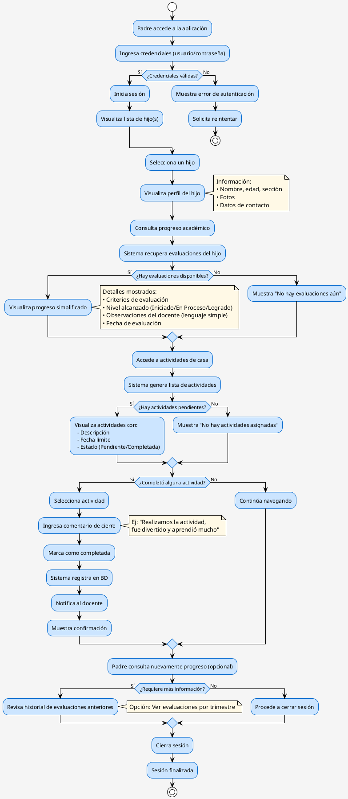

# Diagrama de Proceso — Padre de Familia

## Descripción General

Este diagrama de proceso muestra el flujo de actividades y decisiones que realiza un **Padre de Familia** al utilizar el módulo de monitoreo en la plataforma Semilleros UTN. Incluye puntos de decisión, interacciones con el sistema y resultados esperados.

---

## Estructura del Proceso

### **Entrada**
- Padre con credenciales de acceso
- Conexión a internet/dispositivo

### **Proceso Principal**
- Autenticación
- Visualización de perfil del hijo
- Consulta de progreso académico
- Visualización de actividades
- Decisión: ¿Marcar como completada?
- Feedback al sistema

### **Salida**
- Confirmación de actividad completada
- Notificación al docente
- Estado del progreso actualizado

---

## Código PlantUML — Diagrama de Actividades (Para Generar Imagen)

Copia el siguiente código en [PlantUML Online](https://www.plantuml.com/plantuml/uml/) o en tu herramienta IA:



---

## Flujo Detallado del Proceso

### **FASE 1: ACCESO Y AUTENTICACIÓN**

**Paso 1.1 — Inicio de Sesión**
```
Entrada:    Padre abre la aplicación
Acción:     Ingresa usuario y contraseña
Validación: Sistema verifica en BD
Resultado:  
  ✓ Éxito → Continúa a Paso 1.2
  ✗ Fallo → Muestra error, regresa a inicio
```

**Paso 1.2 — Carga del Dashboard**
```
Acción:     Sistema recupera información:
            - Hijos asociados
            - Últimas evaluaciones
            - Actividades pendientes
Tiempo:     2-3 segundos (con caché optimizado)
Resultado:  Se muestra panel principal
```

---

### **FASE 2: VISUALIZACIÓN DE PERFIL**

**Paso 2.1 — Seleccionar Hijo**
```
Pantalla:   Lista de hijo(s) con fotos
Acción:     Padre toca/hace clic en nombre del hijo
Resultado:  Se carga perfil del hijo
Datos:
  • Nombre completo
  • Edad
  • Sección/Grado
  • Fotografía
  • Información de contacto del docente
```

**Paso 2.2 — Visualizar Perfil Completo**
```
Información mostrada (simplificada para padre):
  ✓ Nombre, edad, sección
  ✓ Docentes asignados
  ✓ Horarios de clases
  ✓ Resumen de progreso general
  ✗ NO muestra: Datos técnicos de evaluación
```

---

### **FASE 3: CONSULTA DE PROGRESO ACADÉMICO**

**Paso 3.1 — Acceder a Progreso**
```
Acción:     Padre toca botón "Ver Progreso"
Sistema:    Query: obtenerProgresoHijo(estudianteId)
Respuesta:  
  {
    ultima_evaluacion: {
      criterios: [{ nombre, nivel_alcanzado }],
      observaciones: "Lenguaje simplificado para padre",
      fecha: "2026-05-30"
    }
  }
```

**Paso 3.2 — Visualizar Progreso**
```
Datos mostrados (FILTRADOS y SIMPLIFICADOS):
  ✓ Nivel de logro por criterio: 🟩 Logrado | 🟨 En Proceso | 🟥 Iniciado
  ✓ Observaciones sin tecnicismos (cumple RF-F02 y RNF-08)
  ✓ Fecha de evaluación
  ✓ Recomendaciones del docente
  
Ejemplo de conversión de lenguaje:
  Docente: "Demuestra dificultad en la decodificación fonética"
  Padre:   "Necesita practicar la lectura en casa"
```

---

### **FASE 4: CONSULTA DE ACTIVIDADES DE CASA**

**Paso 4.1 — Acceder a Actividades**
```
Acción:     Padre toca "Actividades de Casa"
Sistema:    Query: obtenerActividadesCasa(estudianteId)
Respuesta:  Lista ordenada cronológicamente
```

**Paso 4.2 — Visualizar Lista**
```
Información por actividad:
  ✓ Título de la actividad
  ✓ Descripción comprensible
  ✓ Fecha de asignación
  ✓ Fecha límite
  ✓ Estado: 
      🔵 Pendiente (no iniciada)
      🟡 En progreso (en revisión)
      🟢 Completada (confirmada)
  ✓ Duración estimada
```

---

### **FASE 5: MARCAR ACTIVIDAD COMPLETADA**

**Paso 5.1 — Seleccionar Actividad**
```
Acción:     Padre selecciona actividad pendiente
Resultado:  Se abre vista detallada
```

**Paso 5.2 — Ingresar Comentario**
```
Campo:      Texto libre ("Comentario de cierre")
Ejemplo:    "Realizamos la actividad el domingo, 
             el niño aprendió sobre las formas geométricas"
Límite:     250 caracteres (aprox. 2-3 líneas)
```

**Paso 5.3 — Confirmar Finalización**
```
Acción:     Padre toca "Marcar como Completada"
Validación: ¿Comentario completado?
            Sí → Continúa | No → Solicita comentario

Mutation:   marcarActividadCompletada(
              estudianteId: ID!,
              actividadId: ID!,
              comentario: String!
            )

Resultado:
  ✓ Actividad pasa a estado "Completada"
  ✓ Timestamp se registra
  ✓ Comentario se almacena en BD
  ✓ Notificación se envía al docente
  ✓ Se muestra confirmación visual
```

**Paso 5.4 — Confirmación Visual**
```
Pantalla:   "✓ Actividad completada"
Mensaje:    "El docente ha sido notificado"
Tiempo:     2 segundos
Resultado:  Regresa a lista de actividades actualizada
```

---

### **FASE 6: CONSULTA DE HISTORIAL (OPCIONAL)**

**Paso 6.1 — Ver Evaluaciones Anteriores**
```
Acción:     Padre toca "Historial" o "Ver más"
Sistema:    Recupera evaluaciones históricas por trimestre
Visualiza:  
  • Progreso mes a mes
  • Tendencias de aprendizaje
  • Comparativa con evaluaciones previas
```

---

### **FASE 7: CIERRE DE SESIÓN**

**Paso 7.1 — Logout**
```
Acción:     Padre toca "Cerrar Sesión"
Sistema:    
  ✓ Limpia localStorage
  ✓ Anula token de sesión
  ✓ Cierra conexión
  ✓ Redirige a pantalla de login

Resultado:  Sesión finalizada, datos privados protegidos
```

---

## Decisiones Clave en el Proceso

### **Decisión 1: ¿Credenciales Válidas?**
```
Camino A (Sí):  Continúa al dashboard
Camino B (No):  Muestra error, permite reintentos (máx. 3)
                Ofrece "¿Olvidó su contraseña?"
```

### **Decisión 2: ¿Evaluaciones Disponibles?**
```
Camino A (Sí):  Muestra evaluaciones en formato simplificado
Camino B (No):  Muestra placeholder "No hay evaluaciones aún"
                Ej: "El docente aún no ha registrado evaluaciones"
```

### **Decisión 3: ¿Actividades Pendientes?**
```
Camino A (Sí):  Muestra lista de actividades
Camino B (No):  Muestra "No hay actividades asignadas en este momento"
```

### **Decisión 4: ¿Completó Actividad?**
```
Camino A (Sí):  Requiere comentario → Marca como completada → Notifica docente
Camino B (No):  Continúa navegando o cierra sesión
```

### **Decisión 5: ¿Requiere Más Información?**
```
Camino A (Sí):  Accede a historial/evaluaciones anteriores
Camino B (No):  Procede a cerrar sesión
```

---

## Instrucciones para Generar la Imagen con IA

### **Opción 1: ChatGPT o Claude**
```
Prompt sugerido:

"Genera un diagrama de flujo de proceso en formato imagen basándote en 
la siguiente especificación PlantUML (diagrama de actividades UML):

[Copia el código PlantUML de arriba aquí]

Requisitos:
- Inicio (círculo) en la parte superior
- Flujo de actividades representadas como rectángulos redondeados
- Rombos para decisiones (¿Credenciales válidas?, ¿Hay evaluaciones?)
- Flechas indicando dirección del flujo (verde para Sí, rojo para No)
- Notas aclaratorias en algunos pasos (información mostrada)
- Final (círculo) en la parte inferior
- Colores: Azul para actividades, Amarillo para notas
- Orientación: De arriba a abajo (top-to-bottom)
- Estilo profesional, legible, con todas las ramificaciones visibles"
```

### **Opción 2: PlantUML Online**
1. Ve a https://www.plantuml.com/plantuml/uml/
2. Copia el código de la sección "Código PlantUML"
3. Pégalo en el editor
4. Haz clic en "Save as PNG" o "Export"
5. Descarga la imagen

### **Opción 3: Draw.io / Lucidchart (Manual)**
```
Elementos a recrear:

1. Inicio (círculo pequeño azul)
2. Actividades (rectángulos redondeados azul claro):
   - Padre accede a la aplicación
   - Ingresa credenciales
   - Visualiza lista de hijo(s)
   - Selecciona un hijo
   - ... (continúa con todas)

3. Decisiones (rombos amarillos):
   - ¿Credenciales válidas?
   - ¿Hay evaluaciones disponibles?
   - ¿Hay actividades pendientes?
   - ¿Completó alguna actividad?
   - ¿Requiere más información?

4. Flechas:
   - Líneas sólidas normales (flujo estándar)
   - Líneas verdes para "Sí"
   - Líneas rojas para "No"

5. Notas (cajas amarillas):
   - Información específica de ciertas actividades
   - Detalles de datos mostrados en pantalla

6. Fin (círculo pequeño azul)
```

---

## Puntos de Validación del Proceso

| Fase | Validación | Acción si Falla |
|---|---|---|
| **Autenticación** | Credenciales existen en BD | Muestra error, permite reintentar |
| **Carga de perfil** | Hijo asociado al padre | Muestra lista vacía con opción de contactar soporte |
| **Progreso académico** | Evaluaciones registradas | Muestra placeholder "No hay evaluaciones aún" |
| **Actividades de casa** | Actividades asignadas | Muestra lista vacía con fecha próxima estimada |
| **Marca completada** | Comentario + validación | Rechaza si comentario está vacío |
| **Notificación al docente** | Sistema de mensajería activo | Registra en cola, reintenta cada hora |

---

## Tiempo Estimado de Cada Fase

| Fase | Duración | Descripción |
|---|---|---|
| Autenticación | 2-3 seg | Validación de credenciales |
| Carga de datos | 2-3 seg | Recuperación de BD y caché |
| Visualización de perfil | 1-2 seg | Renderizado de datos |
| Consulta de progreso | 2-3 seg | Query a BD + procesamiento |
| Visualización de actividades | 1-2 seg | Renderizado de lista |
| Marcar completada | 2-3 seg | Mutation a BD + notificación |
| **Total promedio** | **12-16 segundos** | Según conexión |

---

## Flujos Alternativos / Excepciones

### **Excepción 1: Contraseña Olvidada**
```
Trigger:    Padre no recuerda contraseña
Acción:     Toca "¿Olvidó su contraseña?"
Sistema:    
  1. Solicita email/usuario
  2. Valida existencia en BD
  3. Envía correo con link de recuperación
  4. Padre ingresa nueva contraseña
  5. Regresa a login con credenciales nuevas
```

### **Excepción 2: Múltiples Hijos**
```
Escenario:  Padre tiene 2+ hijos
Visualiza:  Selector de hijo antes de dashboard
Sistema:    Mantiene último hijo seleccionado para próxima sesión
Cambio:     Puede cambiar de hijo sin cerrar sesión
```

### **Excepción 3: Sin Conexión**
```
Trigger:    Pérdida de conexión durante sesión
Acción:     Sistema muestra alerta "Verificar conexión"
Opciones:   
  • Reintentar (automático cada 5 seg)
  • Volver a inicio
  • Usar datos en caché (si disponibles)
```

### **Excepción 4: Sesión Expirada**
```
Trigger:    Sesión sin actividad > 15 minutos
Acción:     Sistema cierra sesión automáticamente
Resultado:  Redirecciona a login con mensaje "Sesión expirada"
```

---

## Especificaciones Técnicas para la Imagen

### **Dimensiones recomendadas**
- Ancho: 800-1000 px
- Alto: 1400-1600 px (proceso largo, requiere más altura)
- Resolución: 300 DPI (para impresión)

### **Colores sugeridos**
- Inicio/Fin: Azul (#0066CC)
- Actividades: Azul claro (#CCE5FF)
- Decisiones: Amarillo (#FFE680)
- Flechas Sí: Verde (#00AA00)
- Flechas No: Rojo (#CC0000)
- Notas: Amarillo pálido (#FFF9E6)
- Líneas: Gris oscuro (#333333)

### **Fuentes**
- Fuente principal: Arial o Helvetica
- Tamaño: 10-11pt para actividades
- Tamaño: 9pt para etiquetas de flechas (Sí/No)
- Peso: Negrilla para inicio/fin

---

## Integración con Backend

### **API Calls Involucradas**

```
1. LOGIN:
   POST /graphql
   mutation login(username, password)
   
2. OBTENER PROGRESO:
   GET /graphql
   query obtenerProgresoHijo(estudianteId)
   
3. OBTENER ACTIVIDADES:
   GET /graphql
   query obtenerActividadesCasa(estudianteId)
   
4. MARCAR COMPLETADA:
   POST /graphql
   mutation marcarActividadCompletada(estudianteId, actividadId, comentario)
   
5. HISTORIAL:
   GET /graphql
   query obtenerHistorialEvaluaciones(estudianteId, periodo)
```

---

## Requisitos Cumplidos

| RF | Descripción | Paso en Proceso |
|---|---|---|
| **RF-F01** | Visualizar perfil del hijo | Fase 2: Visualización de Perfil |
| **RF-F02** | Ver progreso simplificado | Fase 3: Consulta de Progreso (lenguaje simple) |
| **RF-F04** | Marcar actividades completadas | Fase 5: Marcar Actividad Completada |
| **RNF-08** | Filtrar tecnicismos | Fase 3, Paso 3.2 (sin lenguaje pedagógico) |

---

## Archivo Generado
- **Nombre**: `Diagrama_Proceso_Padre_De_Familia.md`
- **Ubicación**: `PdfInfo/`
- **Fecha**: 2026-06-01
- **Versión**: 1.0
- **Tipo**: Diagrama de Actividades (Activity Diagram)
